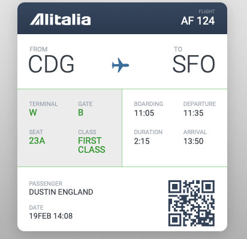

# Click Travel

**Dojo** : Récupérer un billet d'avion pour aller à la destination de vos rêves


# Partie 1

- Cloner en local le repository Github du front end : https://github.com/bratosab/click-travel-ng14
- Installer les dépendances npm et lancer le projet (Infos à la fin du readme)
- Récupérer et afficher les destinations de rêve par les destinations de rêve de l'API, pour se faire :
  1. Créer un service `click-travel` et l'injecter dans l'app,
  2. Créer une méthode pour récupérer les données de l'API `https://travel-api.clicksomeone.com/destinations` - [Swagger de l'API](https://travel-api.clicksomeone.com/explorer/#/DestinationController/DestinationController.find),
  3. Implémenter l'appel de cette méthode dans le composant `AppComponent` et filtrer par les destinations de rêves (`isDreamDestination: true`), de préférence avec du [**RxJS**](https://www.learnrxjs.io/learn-rxjs/operators/transformation/map),
  4. Remplacer les boutons codés en dur de la home page par les destinations de rêves dynamiques.

# Partie 2

- Ajouter la librairie de composant PrimeNG en utilsant le Getting started ici : https://www.primefaces.org/primeng/setup
- Changer les boutons de la home page pour utiliser le composant bouton de PrimeNG : https://www.primefaces.org/primeng/button
- Ajouter un toggle button (https://www.primefaces.org/primeng/togglebutton) pour activer ou desactiver le filtre (`isDreamDestination`) implémenter auparavent pour afficher toutes les destinations.

# Partie 3

- Au clic sur un des boutons, naviguer vers une page qui permet d'afficher la liste des billets d'avion disponible pour se rendre à la destination de rêve sélectionnée, en utilisant le router Angular. Vous pouvez passez l'information de la destination dans un query param de l'URL.
- Implementer l'appel API dans un service pour récuperer la liste des billets est récupérable sur `https://travel-api.clicksomeone.com/tickets` - [Swagger de l'API](https://travel-api.clicksomeone.com/explorer/#/TicketController/TicketController.find)
  * Cette liste est filtrable en passant un paramètre `filter` en query param, précisant la propriété et la valeur du filtre, example : [Vols pour New York](GET "https://travel-api.clicksomeone.com/tickets?filter=%7B%0A%20%20%22where%22%3A%20%7B%20%22to%22%3A%20%22NYC%22%20%7D%0A%7D") :
    * Valeur de `filter` :
     ```json 
     { "where": { "to": "NYC" } } 
     ```
- Afficher la liste des billets dans un composants tableau PrimeNG : https://www.primefaces.org/primeng/table/selection
Afficher les colonnes : 
    - Le nom du vol (`flight`)
    - La ville de départ (`from`)
    - La ville d'arrivée (`to`)
    - La classe du billet (`class`)
# Partie 4

- Au clic sur un billet de la liste, afficher dans une Dialog PrimeNG : https://www.primefaces.org/primeng/dialog
Le billet avec le même design que le billet suivant :



Avec les champs suivant :

- Le nom du passager (`passenger`)
- Le nom du vol (`flight`)
- La ville de départ (`from`)
- La ville d'arrivée (`to`)
- La classe du billet (`class`)
- La porte d'embarquement (`gate`)
- Le siège (`seat`)
- Le numéro du billet (`number`)
- La date du vol (a extraire de `time`)
- L'heure du vol (a extraire de `time`)
- L'heure d'embarquement (= L'heure du vol - 30 minutes)
- La durée (j'ai oublié de le mettre dans l'API 😞 , on va mettre 4h)
- L'heure d'arriver (= L'heure du vol + la durée)


Le code CSS et HTML tu ticket est disponible ici : https://codepen.io/bratosab/pen/qBxGrgQ

# Partie 5

Nous voulons pouvoir ajouter des nouvelles destinations dans l'API.
- Ajouter un module Admin sur un path `/admin` allant vers une page d'administration.
- Sur cette nouvelle page, ajouter un bouton qui ouvre une Dialog avec un formulaire permettant de saisir une nouvelle destination, utilisez les formulaire reactif.
- Ajouter et gerer l'appel API : POST vers `/destinations`.
- Ajouter un Validateur dynamique permettant de vérifier que le code de la destination saisie n'est pas déjà utilisé.

# Partie 6

L'application fonctionne super bien et fait le Buzz !
- Internationnaliser l'application pour permettre de la traduire dans plusieurs langues à l'aide de i18n.

# Les liens

- Code Front : https://github.com/bratosab/click-travel-ng14

- Code API : https://github.com/bratosab/click-travel-api ou [image Docker](https://hub.docker.com/r/bratosab/click-travel-api) => à récupérer en cas de force majeur si l'API est down

- Swagger api : https://travel-api.clicksomeone.com/explorer/

# Infos :

Le back-end est disponible sur internet, mais vous pouvez l'heberger chez vous si vous le souhaiter.


# ClickTravelNg14 Angular Information 

This project was generated with [Angular CLI](https://github.com/angular/angular-cli) version 14.0.2.

## Development server

Run `ng serve` for a dev server. Navigate to `http://localhost:4200/`. The application will automatically reload if you change any of the source files.

## Code scaffolding

Run `ng generate component component-name` to generate a new component. You can also use `ng generate directive|pipe|service|class|guard|interface|enum|module`.

## Build

Run `ng build` to build the project. The build artifacts will be stored in the `dist/` directory.

## Running unit tests

Run `ng test` to execute the unit tests via [Karma](https://karma-runner.github.io).

## Running end-to-end tests

Run `ng e2e` to execute the end-to-end tests via a platform of your choice. To use this command, you need to first add a package that implements end-to-end testing capabilities.

## Further help

To get more help on the Angular CLI use `ng help` or go check out the [Angular CLI Overview and Command Reference](https://angular.io/cli) page.
